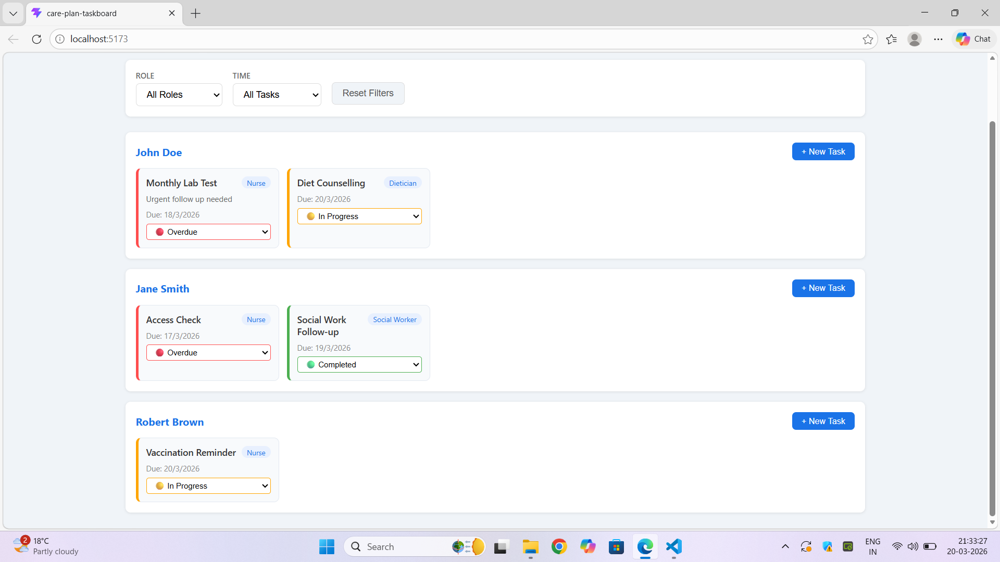
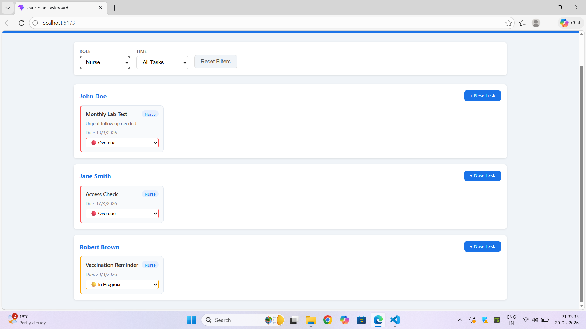

# Care Plan Taskboard

A frontend task management system for dialysis center staff — nurses, dieticians, and social workers — to track and manage patient care tasks.

---

## Setup Instructions

### Prerequisites
- Node.js v18+
- npm v9+

### Run in under 5 minutes
```bash
# 1. Clone the repository
git clone https://github.com/sukumar-1230/assignment3-care_plan_taskboard-.git

# 2. Move into the folder
cd assignment3-care_plan_taskboard-

# 3. Install dependencies
npm install

# 4. Start the app
npm run dev
```

Open your browser at `http://localhost:5173`

### Run Tests
```bash
npm run test
```

---

## Architecture Overview
```
src/
├── types/          # Domain contracts — Patient, Task, Role, TaskStatus
├── mocks/          # MSW mock handlers simulating the backend API
├── api/            # Axios API client — all server calls in one place
├── store/          # Zustand store — UI filter state only
├── hooks/          # React Query hooks — data fetching and mutations
├── utils/          # Pure helper functions — filtering and label mapping
├── components/
│   ├── FilterBar/        # Role and time filter dropdowns
│   ├── TaskCard/         # Single task display and status update
│   ├── Taskboard/        # Patient rows with their tasks
│   └── CreateTaskModal/  # New task form with validation
└── tests/          # Vitest + Testing Library test files
```

### Data Flow
```
User Action
    ↓
Component (e.g. TaskCard)
    ↓
React Query Hook (useUpdateTask)
    ↓ optimistic update → UI updates instantly
API Client (api/tasks.ts)
    ↓
MSW Mock Handler (mocks/handlers.ts)
    ↓ success → settle
    ↓ failure → rollback to previous state
```

### State Management Decision

| Concern | Tool | Why |
|---|---|---|
| Server data (patients, tasks) | React Query | Handles caching, loading, error, retry automatically |
| UI filter state | Zustand | Lightweight, no boilerplate for simple client state |

React Query and Zustand are kept separate on purpose — server state and UI state are different concerns and should not be mixed.

---

## API Contracts

### Patient
```ts
interface Patient {
  id: string
  name: string
  unit: string
  age: number
}
```

### Task
```ts
interface Task {
  id: string
  patientId: string
  title: string
  description?: string
  status: 'overdue' | 'in_progress' | 'completed'
  assignedRole: 'nurse' | 'dietician' | 'social_worker'
  dueDate: string   // ISO 8601
  createdAt: string // ISO 8601
  notes?: string
}
```

### Endpoints
| Method | Endpoint | Description |
|---|---|---|
| GET | `/patients` | List all patients |
| GET | `/patients/:id/tasks` | Get tasks for a patient |
| POST | `/patients/:id/tasks` | Create a new task |
| PATCH | `/tasks/:id` | Update task status or fields |

---

## Assumptions and Trade-offs

### Assumptions
1. **No authentication** — all staff roles are assumed to be already logged in. A real system would show only tasks relevant to the logged-in user's role.
2. **Status drives overdue logic** — a task marked "completed" is never shown as overdue even if the due date has passed.
3. **MSW as backend** — the assignment allows stubbing the backend. MSW was chosen over a real Express server because it runs in the browser, requires no extra port, and makes the project easier to run locally.
4. **Optimistic updates** — task status changes update the UI instantly and roll back if the server fails. This makes the app feel fast even on slow networks.
5. **Flat task list per patient** — tasks are not grouped by type or category. This keeps the UI simple while still meeting all requirements.

### Trade-offs
| Decision | Trade-off |
|---|---|
| MSW mock instead of real backend | Faster to run locally, but not production-ready |
| React Query for server state | More setup than useState, but handles edge cases automatically |
| Zustand for filter state | Could have used Context, but Zustand is cleaner with no provider needed |
| Flat task layout | Easier to scan quickly, but a kanban column layout might work better at scale |

---

## Integration & Failure Modes

### Network Failures
- React Query retries failed requests **2 times** before showing an error state
- Optimistic updates **roll back** to previous state if the server returns an error
- Each patient row handles its own loading and error state independently — one failure does not break the whole board

### Missing or Unexpected Fields
- All optional fields (`notes`, `description`) use `?.` optional chaining
- Missing fields fall back to safe defaults rather than crashing
- TypeScript interfaces enforce correct shapes at compile time

### Adding a New Role
1. Add the new role to the `Role` type in `src/types/index.ts`:
```ts
export type Role = 'nurse' | 'dietician' | 'social_worker' | 'pharmacist'
```
2. Add a label in `src/utils/taskFilters.ts`:
```ts
pharmacist: 'Pharmacist'
```
3. Add the option in `src/components/FilterBar/FilterBar.tsx`

TypeScript will show compile errors everywhere the new role needs to be handled — making it impossible to forget a case.

### Adding a New Task Type
1. Add a `category` field to the `Task` interface
2. Update the `CreateTaskModal` form to include a category dropdown
3. Update `filterTasks` if filtering by category is needed

---

## Known Limitations & What I Would Do Next

### Known Limitations
- Data is not persisted — refreshing the page resets all tasks to mock data
- No authentication or role-based access control
- No pagination for large patient lists
- No drag-and-drop between status columns

### What I Would Do Next
1. **Real backend** — replace MSW with an actual Express or FastAPI server with MongoDB
2. **Authentication** — add login so each staff member sees only their relevant tasks
3. **Persistence** — connect to a real database so data survives page refresh
4. **Notifications** — alert nurses when a task becomes overdue
5. **Drag and drop** — allow dragging task cards between status columns
6. **Pagination** — handle large numbers of patients efficiently

---

## AI Tools Used

### What I used AI for
- Initial project scaffolding and folder structure
- Boilerplate code for React Query hooks and MSW handlers
- CSS styling for the taskboard layout

### What I reviewed and changed manually
- TypeScript type definitions — reviewed every field and made sure names were meaningful
- Filter logic in `taskFilters.ts` — verified the date comparison logic was correct
- Test cases — added edge cases like empty lists and missing optional fields
- README architecture section — written to reflect actual decisions made

### One example where I disagreed with AI output
The AI initially suggested using `localStorage` to persist filter state. I removed this because filter state is UI-only and session-specific — a nurse should start with clean filters each shift. Persisting filters across sessions would cause confusion if a nurse forgets they had a filter active from the previous day.

---

## Screenshots

### Main Taskboard View


### Filter Bar


### Create New Task
